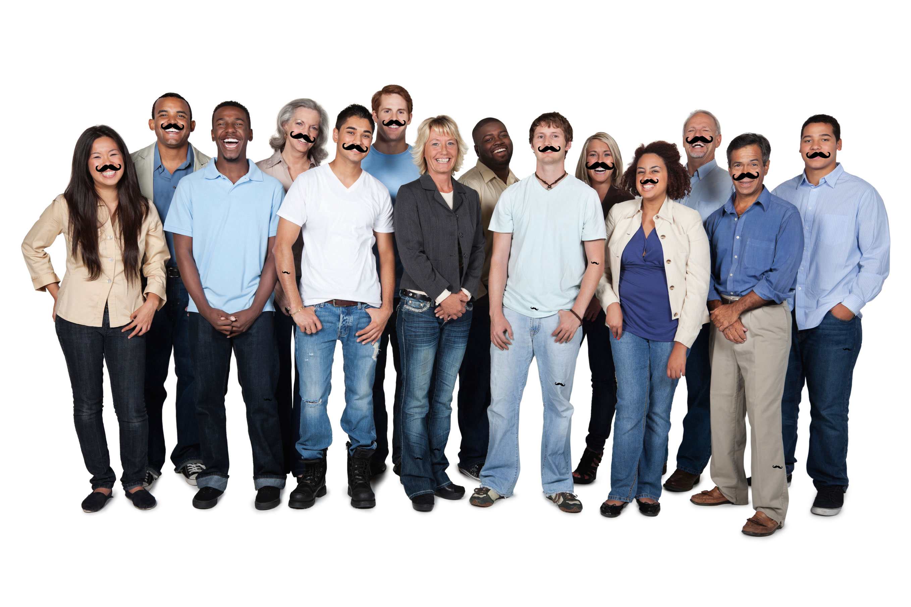

# Mustache Mash

MustacheMash will be an awesome website which puts mustaches on all your Facebook friends.

# Current status

I have implemented face detection in [unixpickle/haar](https://github.com/unixpickle/haar). For mustachemash, I used Haar-like features to detect the mouth+nose in an image and add mustaches. Here is an example result:

